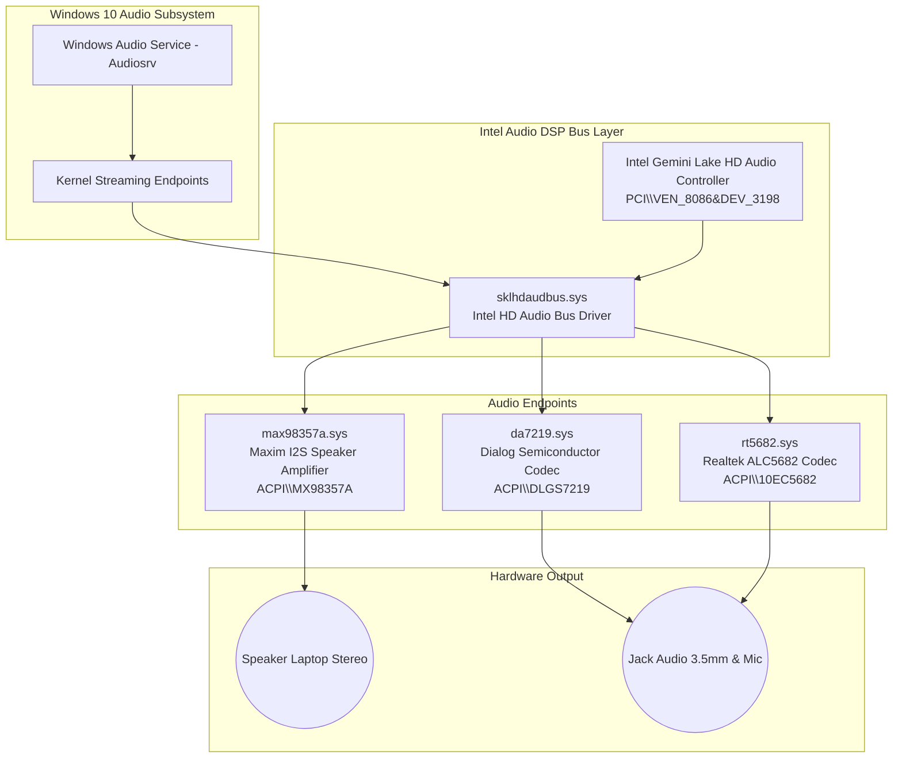

# 🎵 Driver Audio Lenovo IdeaPad 3 11IGL05 Chromebook (Windows 10 64-Bit)

[](https://github.com/muhammadfikri-dev/ideapad3-chromebook-windows-audio/actions/workflows/build-and-release.yml)
[](https://ark.intel.com)
[](https://microsoft.com/windows)
[](LICENSE)

Repositori ini menyediakan solusi driver audio lengkap, terotomatisasi, dan siap pakai untuk **Chromebook Lenovo IdeaPad 3 11IGL05** yang menjalankan sistem operasi **Windows 10 64-bit**. 

Dilengkapi dengan pipeline **GitHub Actions** yang secara otomatis meng-compile, menandatangani sertifikat digital (Code Signing), dan mengemas seluruh binary driver menjadi file ZIP rilis siap pakai.

---

## 💻 Spesifikasi Perangkat Target

| Komponen | Spesifikasi |
| :--- | :--- |
| **Model Perangkat** | Lenovo IdeaPad 3 CB 11IGL05 (MTM: 82BA) |
| **ChromeOS Board Name** | **`LICK`** (Baseboard: **`Octopus`**) |
| **Prosesor / SoC** | Intel® Celeron® N4020 (Gemini Lake Refresh) |
| **Audio Controller (PCI)** | Intel Gemini Lake HD Audio Controller (`PCI\VEN_8086&DEV_3198`) |
| **Speaker Amplifier (Internal)** | Maxim MAX98357A / MAX98360A I2S Amp (`ACPI\MX98357A`) |
| **Headphone & Mic Codec** | Dialog Semiconductor DA7219 (`ACPI\DLGS7219`) / Realtek RT5682 (`ACPI\10EC5682`) |
| **Arsitektur Target** | Windows 10 64-bit (x64) |

---

## 🏗️ Arsitektur Driver Audio



---

## 🚀 Fitur Utama & Otomatisasi GitHub Actions

Proyek ini telah dikonfigurasi dengan alur kerja **GitHub Actions (`.github/workflows/build-and-release.yml`)** yang bekerja secara otomatis:
1. **Cloud Compilation**: Menggunakan runner `windows-latest` dengan MSBuild dan Windows Driver Kit (WDK) untuk meng-compile 4 proyek driver kernel (`Release|x64`).
2. **Automated Code Signing**: Membuat sertifikat digital test-signing otomatis dan menandatangani binary `.sys` serta file catalog `.cat` menggunakan `signtool.exe` dan `Inf2Cat.exe`.
3. **Packaging & Release**: Memaketkan semua driver, sertifikat, dan skrip instalasi ke dalam `Lenovo-IdeaPad3-11IGL05-Audio-Drivers-x64.zip` dan mempublikasikannya langsung ke menu **Releases** di GitHub.

---

## 📂 Struktur Repositori

```
ideapad3-chromebook-windows-audio/
├── .github/
│   └── workflows/
│       └── build-and-release.yml    # Workflow CI/CD otomatis untuk compile & release
├── drivers/
│   ├── sklhdaudbus/                 # Driver Bus HD Audio & DSP Intel Gemini Lake
│   ├── da7219/                      # Driver Codec Headphone & Mic Dialog DA7219
│   ├── max98357a/                   # Driver Amplifier Speaker Internal Maxim
│   └── rt5682/                      # Driver Codec Realtek ALC5682 (varian alternatif)
├── scripts/
│   ├── Install-Audio-Drivers.bat    # Script instalasi 1-klik (Run as Administrator)
│   ├── Install-Audio-Drivers.ps1    # PowerShell installer (import cert + pnputil)
│   ├── Enable-TestSigning.bat       # Helper untuk mengaktifkan Windows TestSigning
│   ├── Disable-TestSigning.bat      # Helper untuk menonaktifkan TestSigning
│   └── Troubleshoot-Audio.ps1       # Tool diagnosa dan pengecekan perangkat audio
├── IdeaPad3AudioDrivers.sln         # Solution master Visual Studio
├── PANDUAN_INSTALASI.md             # Panduan instalasi langkah demi langkah bahasa Indonesia
└── README.md
```

---

## 🛠️ Cara Menggunakan dengan GitHub Actions

### 1. Push Repositori ke Akun GitHub Anda
Jika Anda mengunggah repositori ini ke akun GitHub Anda:
```bash
git init
git add .
git commit -m "Initial commit - Lenovo IdeaPad 3 11IGL05 Windows 10 Audio Drivers"
git branch -M main
git remote add origin https://github.com/<USERNAME>/<REPO_NAME>.git
git push -u origin main
```

### 2. Jalankan Build di GitHub Actions
- Buka tab **Actions** di repositori GitHub Anda.
- Pilih workflow **Build and Package Lenovo IdeaPad 3 11IGL05 Audio Drivers**.
- Klik tombol **Run workflow** -> Pilih branch `main` -> Klik **Run workflow**.
- GitHub Actions akan meng-compile seluruh driver secara otomatis dalam 2-4 menit!

### 3. Unduh Driver Siap Pakai
- Setelah proses build selesai, buka bagian **Artifacts** atau **Releases** di repositori GitHub Anda.
- Unduh file `Lenovo-IdeaPad3-11IGL05-Audio-Drivers-x64.zip`.

---

## 📥 Cara Instalasi di Chromebook Lenovo IdeaPad 3

1. **Ekstrak File ZIP**:
   Ekstrak file `Lenovo-IdeaPad3-11IGL05-Audio-Drivers-x64.zip` yang telah diunduh ke folder di Chromebook Anda (misalnya di Desktop atau `C:\Drivers`).
2. **Jalankan Installer**:
   Klik kanan pada file **`Install-Audio-Drivers.bat`**, lalu pilih **Run as Administrator**.
3. **Proses Otomatis**:
   Skrip akan secara otomatis:
   - Mengaktifkan mode **TestSigning** di Windows 10.
   - Memasang sertifikat digital driver ke LocalMachine Root & TrustedPublisher.
   - Memasang driver `sklhdaudbus`, `max98357a`, `da7219`, dan `rt5682`.
   - Merestart Windows Audio Service.
4. **Restart Laptop**:
   Lakukan **Restart** pada Chromebook Anda.
5. **Selesai**:
   Speaker internal dan audio jack headphone akan langsung berfungsi normal!

---

## 🔍 Diagnosa & Troubleshooting

Jika setelah instalasi dan restart suara belum keluar:
1. Buka PowerShell sebagai Administrator di folder driver.
2. Jalankan:
   ```powershell
   .\Troubleshoot-Audio.ps1
   ```
3. Skrip akan memindai seluruh hardware ID audio, status driver, dan layanan audio, serta menghasilkan file laporan `audio_diag_report.txt`.

---

## 📄 Lisensi & Kredit

- Berdasarkan implementasi driver open-source oleh komunitas Chrultrabook & CoolStar.
- Dilisensikan di bawah [GPL v2 / MIT License](LICENSE).

---

<p align="center">
  Dibuat dengan ❤️ oleh <b>Muhammad Fikri Dev</b>
</p>
